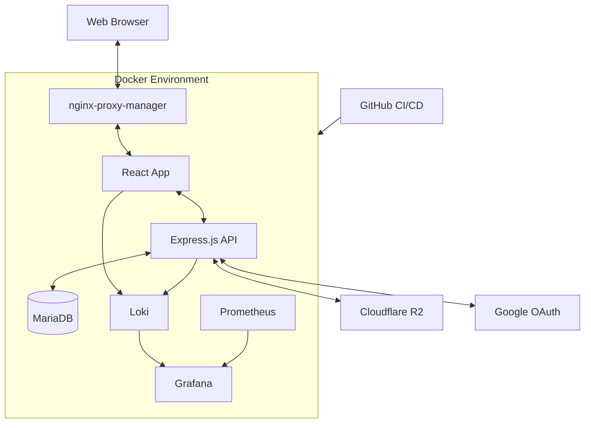

# Virtual News Producer (VNP)

## Overview

Virtual News Producer is a cutting-edge content management system designed for a 100% remote workforce to collect, write, and deliver news content to radio stations across the United States. This cross-platform web application replaces the obsolete News Dashboard software, providing a more efficient and user-friendly solution for modern newsrooms.

## Key Features

1. **Multi-role User System**: Supports SuperAdmin, Admin, Staff (Reporter/Anchor), and Public user roles.
2. **Content Management**: Efficiently manage Stories, Casts, Wires, and Blogs.
3. **In-browser Audio Suite**: Comprehensive audio recording and editing capabilities.
4. **Drag-and-Drop Functionality**: Intuitive interface for content organization and management.
5. **SIP Phone Integration**: Seamless communication tools for reporters.
6. **Newscast Creation and Management**: Streamlined process for creating and managing newscasts.
7. **Multi-station Support**: Ability to manage multiple radio stations within a single interface.

## Tech Stack

- **Frontend**: React (Latest LTS), Vite, Material-UI, React DnD, Wavesurfer.js, RecordRTC
- **Backend**: Express.js
- **Database**: MariaDB with Prisma ORM
- **State Management**: React Query
- **Testing**: Jest with React Testing Library
- **Package Manager**: pnpm
- **Monorepo Structure**: pnpm workspaces
- **API Documentation**: Swagger/OpenAPI
- **Containerization**: Docker
- **CI/CD**: GitHub Actions
- **Logging**: Loki, Grafana, Prometheus

## System Architecture



## Development Setup

1. Ensure you have Docker (v27.3.1+) and Docker Compose (v2.29.7+) installed.
2. Clone the repository: `git clone https://github.com/yourusername/vnproducer.git`
3. Navigate to the project directory: `cd vnproducer`
4. Copy the `.env.example` file to `.env` and fill in the necessary environment variables.
5. Run `pnpm install` to install dependencies.
6. Start the development environment: `docker-compose up -d`
7. Access the application at `http://localhost:3000`

## Testing

Run the test suite with:

```bash
pnpm test
```

We follow a Test-Driven Development (TDD) approach. Please ensure all new features are accompanied by appropriate tests.

## Deployment

The application uses a blue-green deployment strategy from development to production, managed through GitHub Actions. Refer to the `.github/workflows` directory for CI/CD configuration.

## Contributing

Please read [CONTRIBUTING.md](CONTRIBUTING.md) for details on our code of conduct and the process for submitting pull requests.

## License

This project is licensed under the MIT License - see the [LICENSE.md](LICENSE.md) file for details.

