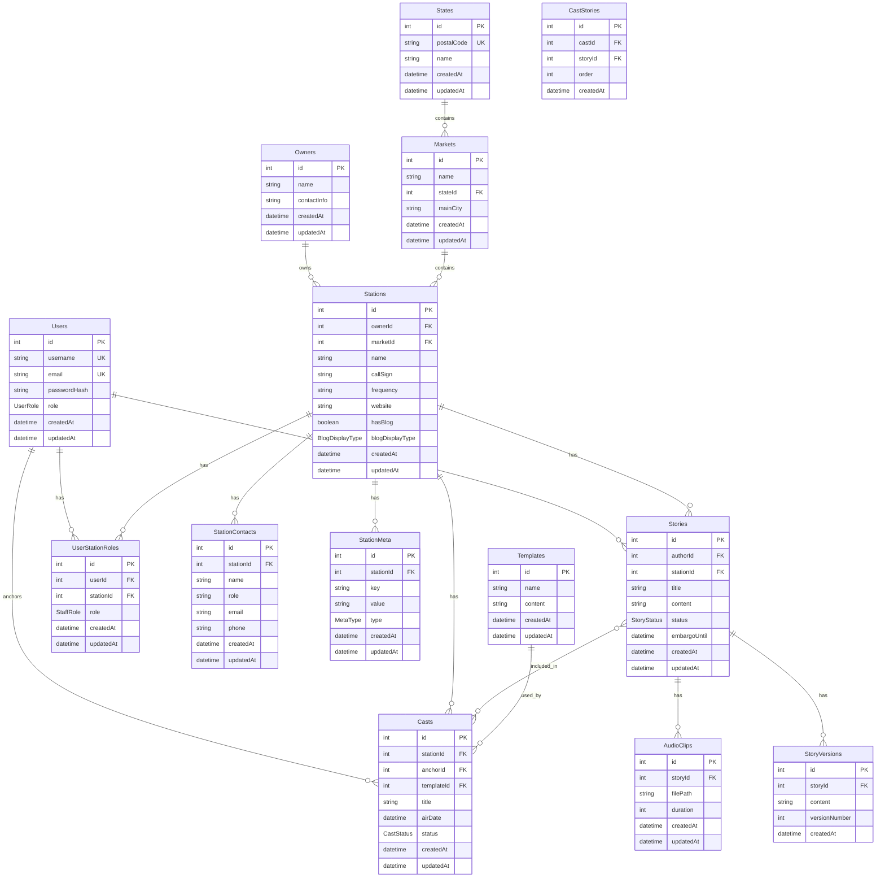

# Virtual News Producer Database Schema

## Tables

### 1. Users
- `id` (PK): INT AUTO_INCREMENT
- `username`: VARCHAR(50) UNIQUE NOT NULL
- `email`: VARCHAR(100) UNIQUE NOT NULL
- `password_hash`: VARCHAR(255) NOT NULL
- `role`: ENUM('SuperAdmin', 'Admin', 'Staff') NOT NULL
- `created_at`: TIMESTAMP DEFAULT CURRENT_TIMESTAMP
- `updated_at`: TIMESTAMP DEFAULT CURRENT_TIMESTAMP ON UPDATE CURRENT_TIMESTAMP

### 2. Owners
- `id` (PK): INT AUTO_INCREMENT
- `name`: VARCHAR(100) NOT NULL
- `contact_info`: TEXT
- `created_at`: TIMESTAMP DEFAULT CURRENT_TIMESTAMP
- `updated_at`: TIMESTAMP DEFAULT CURRENT_TIMESTAMP ON UPDATE CURRENT_TIMESTAMP

### 3. States
- `id` (PK): INT AUTO_INCREMENT
- `postal_code`: CHAR(2) UNIQUE NOT NULL
- `name`: VARCHAR(100) NOT NULL
- `created_at`: TIMESTAMP DEFAULT CURRENT_TIMESTAMP
- `updated_at`: TIMESTAMP DEFAULT CURRENT_TIMESTAMP ON UPDATE CURRENT_TIMESTAMP

### 4. Markets
- `id` (PK): INT AUTO_INCREMENT
- `name`: VARCHAR(100) NOT NULL
- `state_id` (FK): INT
- `main_city`: VARCHAR(100) NOT NULL
- `created_at`: TIMESTAMP DEFAULT CURRENT_TIMESTAMP
- `updated_at`: TIMESTAMP DEFAULT CURRENT_TIMESTAMP ON UPDATE CURRENT_TIMESTAMP

### 5. Stations
- `id` (PK): INT AUTO_INCREMENT
- `name`: VARCHAR(100) NOT NULL
- `owner_id` (FK): INT
- `market_id` (FK): INT
- `call_sign`: VARCHAR(10) NOT NULL
- `frequency`: VARCHAR(10)
- `website`: VARCHAR(255)
- `has_blog`: BOOLEAN DEFAULT FALSE
- `blog_display_type`: ENUM('Full', 'Excerpt')
- `created_at`: TIMESTAMP DEFAULT CURRENT_TIMESTAMP
- `updated_at`: TIMESTAMP DEFAULT CURRENT_TIMESTAMP ON UPDATE CURRENT_TIMESTAMP

### 6. StationMeta
- `id` (PK): INT AUTO_INCREMENT
- `station_id` (FK): INT
- `key`: VARCHAR(100) NOT NULL
- `value`: TEXT
- `type`: ENUM('text', 'document', 'image') NOT NULL
- `created_at`: TIMESTAMP DEFAULT CURRENT_TIMESTAMP
- `updated_at`: TIMESTAMP DEFAULT CURRENT_TIMESTAMP ON UPDATE CURRENT_TIMESTAMP

### 7. StationContacts
- `id` (PK): INT AUTO_INCREMENT
- `station_id` (FK): INT
- `name`: VARCHAR(100) NOT NULL
- `role`: VARCHAR(100)
- `email`: VARCHAR(100)
- `phone`: VARCHAR(20)
- `created_at`: TIMESTAMP DEFAULT CURRENT_TIMESTAMP
- `updated_at`: TIMESTAMP DEFAULT CURRENT_TIMESTAMP ON UPDATE CURRENT_TIMESTAMP

### 8. UserStationRoles
- `id` (PK): INT AUTO_INCREMENT
- `user_id` (FK): INT
- `station_id` (FK): INT
- `role`: ENUM('Reporter', 'Anchor') NOT NULL
- `created_at`: TIMESTAMP DEFAULT CURRENT_TIMESTAMP
- `updated_at`: TIMESTAMP DEFAULT CURRENT_TIMESTAMP ON UPDATE CURRENT_TIMESTAMP

### 9. Stories
- `id` (PK): INT AUTO_INCREMENT
- `title`: VARCHAR(255) NOT NULL
- `content`: TEXT NOT NULL
- `author_id` (FK): INT
- `station_id` (FK): INT
- `status`: ENUM('Draft', 'Published', 'Archived') NOT NULL
- `embargo_until`: DATETIME
- `created_at`: TIMESTAMP DEFAULT CURRENT_TIMESTAMP
- `updated_at`: TIMESTAMP DEFAULT CURRENT_TIMESTAMP ON UPDATE CURRENT_TIMESTAMP

### 10. StoryVersions
- `id` (PK): INT AUTO_INCREMENT
- `story_id` (FK): INT
- `content`: TEXT NOT NULL
- `version_number`: INT NOT NULL
- `created_at`: TIMESTAMP DEFAULT CURRENT_TIMESTAMP

### 11. AudioClips
- `id` (PK): INT AUTO_INCREMENT
- `story_id` (FK): INT
- `file_path`: VARCHAR(255) NOT NULL
- `duration`: INT NOT NULL
- `created_at`: TIMESTAMP DEFAULT CURRENT_TIMESTAMP
- `updated_at`: TIMESTAMP DEFAULT CURRENT_TIMESTAMP ON UPDATE CURRENT_TIMESTAMP

### 12. Casts
- `id` (PK): INT AUTO_INCREMENT
- `station_id` (FK): INT
- `anchor_id` (FK): INT
- `template_id` (FK): INT
- `title`: VARCHAR(255) NOT NULL
- `air_date`: DATETIME
- `status`: ENUM('Draft', 'Recorded', 'Published') NOT NULL
- `created_at`: TIMESTAMP DEFAULT CURRENT_TIMESTAMP
- `updated_at`: TIMESTAMP DEFAULT CURRENT_TIMESTAMP ON UPDATE CURRENT_TIMESTAMP

### 13. CastStories
- `id` (PK): INT AUTO_INCREMENT
- `cast_id` (FK): INT
- `story_id` (FK): INT
- `order`: INT NOT NULL
- `created_at`: TIMESTAMP DEFAULT CURRENT_TIMESTAMP

### 14. Templates
- `id` (PK): INT AUTO_INCREMENT
- `name`: VARCHAR(100) NOT NULL
- `content`: TEXT NOT NULL
- `created_at`: TIMESTAMP DEFAULT CURRENT_TIMESTAMP
- `updated_at`: TIMESTAMP DEFAULT CURRENT_TIMESTAMP ON UPDATE CURRENT_TIMESTAMP

## Relationships

1. Owners have many Stations (one-to-many)
2. Markets have many Stations (one-to-many)
3. Stations have many StationContacts (one-to-many)
4. Stations have many StationMeta entries (one-to-many)
5. Users have many UserStationRoles (one-to-many)
6. Stations have many UserStationRoles (one-to-many)
7. Users author many Stories (one-to-many)
8. Stations have many Stories (one-to-many)
9. Stories have many StoryVersions (one-to-many)
10. Stories have many AudioClips (one-to-many)
11. Stations have many Casts (one-to-many)
12. Users (Anchors) have many Casts (one-to-many)
13. Templates are used in many Casts (one-to-many)
14. Casts have many Stories through CastStories (many-to-many)

15. States have many Markets (one-to-many)

## Notes

1. The `Users` table includes all types of users (SuperAdmin, Admin, Staff).
2. The `UserStationRoles` table allows for users to have different roles (Reporter, Anchor) at different stations.
3. The `Markets` table now references the `States` table instead of having a `state` field directly.
4. The `Stations` table now includes `has_blog` and `blog_display_type` fields to manage blog functionality.
5. The `StationMeta` table allows for storing free-form data including documents, images, and text notes for each station.
6. The `Stories` table represents all content, including what would be displayed on a station's blog.
7. The `StoryVersions` table allows for version control of stories.
8. The `Casts` table represents newscasts, linking to the anchor, station, and template used.
9. The `CastStories` table is a junction table that allows for ordering of stories within a cast.
10. Wire functionality (station, market, and state wires) can be implemented through queries on the `Stories` table, joining with `Stations` and `Markets` as needed.
11. The `States` table has been added to represent US states, with a unique postal code for each state.

